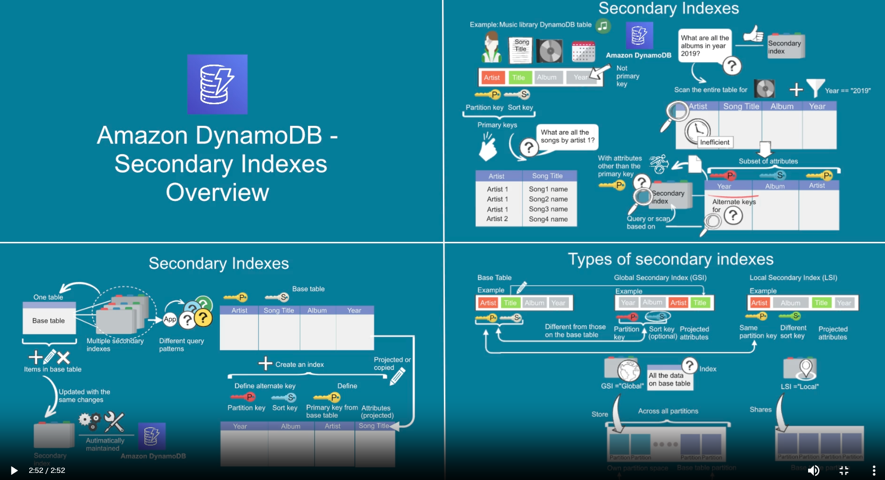
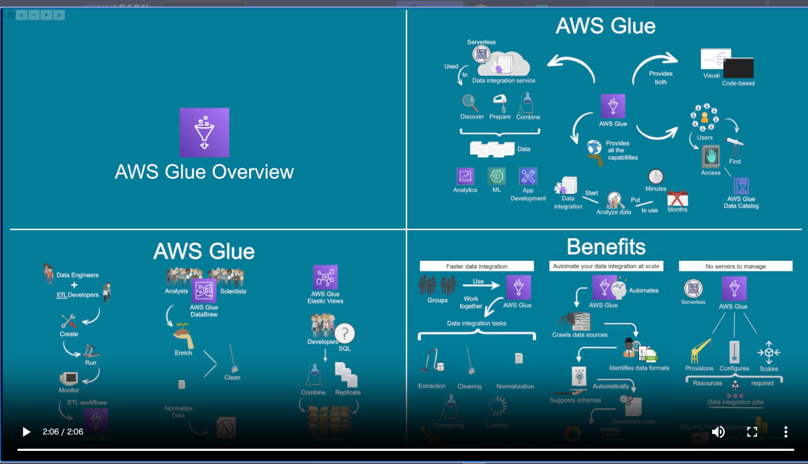

# 勉強日記

## 日付
2026年04月18日

## 学習内容

### AWS SimuLearn: ストリーミング取り込み（LambdaとKinesis Data Firehose）
 - Parquet形式かORC形式にレコード形式を変換できる。
 - Lamnbdaから読み込み→S3へ送信の際に使う。 
-  動的パーティショニング：自動的にキーごとにデータをグループ化してくれるため、データスキャンの量が減る。また、Lambda関数を挟む必要がなくなる。
- パーティションニング：S3のフォルダ構造を作ること。
- JQ形式：JSONを整形するコマンド

### AWS SimuLearn: サーバーレス基盤
- lambdaは様々なサービス（S3、SQSなど）と連携できるサーバーレスサービス
- event変数（JSON形式）の中のキーの値をlambda関数で抽出する。

### AWS SimuLearn: NoSQL データベースの設計
- DynamoDBのグローバルセカンダリインデックス（GSI）で効率的にデータをクエリできる。
- スキャンとクエリの２種類のデータ抽出方法がある。前者はコストパフォーマンスが低いがキーの管理不要（〜1000件以下ならこっちの方がいい）。

### AWS SimuLearn: データ取り込み方法
- AWS GuleはStudio, Databrew, Elastic Viewと使う人の役割と背景知識に合った使い分けができる（データエンジニアの人はETLコードベースのStudio、コードを知らない人はGUIベースのDatabrew。）
- AWS Gule Clower：データからデータ形式を読み取って適切なスキーマを提案してくれる。その後に変換されたデータは、データベースカタログに保存される。

- Kinesis Data FirehoseとKinesis Data Streamsの違い
    - Kinesis Data Firehose:データをバッファリングしてから一括で処理するため時間がかかるが、低コストで抑えられる。バッファリング間隔を調整することで処理時間とコストのバランスを取れる。 
    https://dev.classmethod.jp/articles/introduction-2024-amazon-data-firehose/ 
    - Kinesis Data Streams: データを逐次処理するためリアルタイムでの処理に適している。コストはFirehoseと比較して高くなる。
    https://pages.awscloud.com/rs/112-TZM-766/images/AWS-Black-Belt_2023_AmazonKinesisDataStreams_0430_v1.pdf 

## 気づき
- タイピングミスのエラーが多い。
- 説明書を読めていなくて時間ロスするパターン多い。
